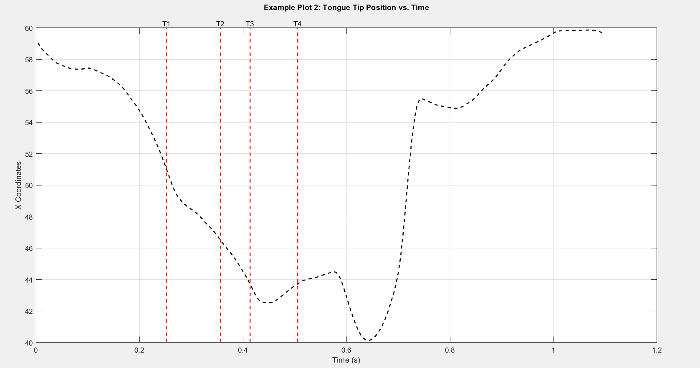

# SPIRE VCV

**SPIRE VCV** is a comprehensive speech production database that includes simultaneous **acoustic** and **electromagnetic articulography (EMA)** data collected from non-native Indian English speakers. This corpus, named **SPIRE VCV**, provides valuable resources for acoustic-articulatory studies, particularly for investigations involving speaking rate variations.

### Key Features of the SPIRE VCV Corpus:
- **Simultaneous Acoustic and Articulatory Data:**  
	The database includes synchronized recordings of speech audio and articulatory movements.

- **VCV Stimuli:**  
	Symmetrical **Vowel-Consonant-Vowel (VCV)** sequences comprising:
	- **Vowels (5):** `/a/, /e/, /i/, /o/, /u/`
	- **Consonants (17):** `/b/, /ch/, /d/, /f/, /g/, /jh/, /k/, /l/, /m/, /n/, /ng/, /p/, /r/, /s/, /t/, /v/, /z/`

- **Speaking Rates:**  
	Recordings were conducted at three distinct speaking rates:
	- **Slow**
	- **Normal**
	- **Fast**

- **Articulatory Data:**  
	Movements of six key speech articulators were tracked in a 3D coordinate system:
	- Upper Lip
	- Lower Lip
	- Jaw
	- Tongue Tip
	- Tongue Body
	- Tongue Dorsum

- **Manual Boundary Annotations:**  
	Precise boundaries for vowels and consonants were manually annotated using spectrograms, waveforms, and glottal pulses.

- **Speaker Demographics:**  
	Data was collected from 10 speakers (5 male, 5 female) aged 18–27, fluent in English, and from diverse Indian language backgrounds.

### Applications:
The SPIRE VCV corpus is ideal for:
- Acoustic-articulatory studies
- Speaking rate-specific investigations
- Analysis of articulatory movement patterns across different speech rates

This database also includes a basic articulatory analysis of consonants, highlighting how articulatory movements vary with speaking rate. Researchers can leverage this resource for a wide range of speech production and phonetic studies.

The stimuli consist of **nonsense, symmetrical VCV (Vowel-Consonant-Vowel) utterances** embedded in the sentence:  
**"Speak VCV today"**  
These are spoken at **three different speaking rates** — slow, normal, and fast — with **three repetitions** each.

### Phonetic Inventory
- **Consonants (17):**  
  `/b/, /ch/, /d/, /f/, /g/, /jh/, /k/, /l/, /m/, /n/, /ng/, /p/, /r/, /s/, /t/, /v/, /z/`
- **Vowels (5):**  
  `/a/, /e/, /i/, /o/, /u/`

### Speakers
- **Total:** 10 non-native Indian English speakers (5 male, 5 female)  
- **Age Range:** 18–27 years  
- **Health:** No speech-related disorders  
- **Background:** Fluent in English (reading, writing, speaking); from various Indian native language backgrounds

---

## Recording and Setup

### Equipment
- **Articulatory data:**  
  Recorded using **AG501 3D Electromagnetic Articulograph (EMA)**
- **Audio data:**  
  Captured with **t.bone EM9600 shotgun unidirectional electret condenser microphone**

### Sampling
- **Audio:** Originally at **48 kHz**, then downsampled to **16 kHz**
- **Articulatory:** Sampled at **250 Hz**

### Preprocessing
- **Filter:**  
  A **10th-order Chebyshev Type II lowpass filter**  
  - Cut-off: **40 Hz**  
  - Stopband attenuation: **40 dB**  
  - Purpose: To remove high-frequency noise from EMA

---

## Sensor Placement

Six sensors were attached to articulators to track 3D movement:
- Upper Lip  
- Lower Lip  
- Jaw  
- Tongue Tip  
- Tongue Body  
- Tongue Dorsum

Additional sensors were placed **behind the left and right ear** to enable head movement correction.

Each of the 6 articulator sensors records movement in 3D, resulting in **18 articulatory features** (6 sensors × 3 axes).


---

## Speaker Instructions

- All speakers were trained prior to recording.
- A GUI displayed each stimulus word on screen.
- Each speaker pronounced the word at:
  - **Slow**
  - **Normal/Habitual**
  - **Fast** rates  
- Each rate had **three repetitions** per stimulus.

---

## VCV Boundary Annotation

VCV boundaries were manually annotated using an in-house **MATLAB tool**, based on:
- **Wideband spectrogram**
- **Raw waveform**
- **Glottal pulses (Praat)**

#### For Unvoiced Consonants:
- Start of C-region: **Last glottal pulse in V1**
- End of C-region: **First glottal pulse at start of V2**

#### For Voiced Consonants:
- Start and end boundaries based on:
  - **Formants** in spectrogram
  - **Time-domain waveform**

In ambiguous cases, annotators discussed and made a **unanimous decision**.

---
### Dataset loading instructions (example)

```matlab
%% Load EMA Data
load ('0.mat');
disp("Size for matrix:"); disp(size(ema));
% Extract articulatory sensor positions
EL1 = ema(1:3,:);   %Right earlobe for head movement correction
EL2 = ema(4:6,:);   %Left earlobe for head movement correction
UL  = ema(7:9,:);   %Upper Lip
LL  = ema(10:12,:); %Lower Lip
Jaw = ema(13:15,:); %Jaw
TT  = ema(16:18,:); %Tongue Tip
TB  = ema(19:21,:); %Tongue Body
TD  = ema(22:24,:); %Tongue Dorsum
% Plot: 3D Trajectories of All Sensors
figure;
plot3(UL(1,:), UL(2,:), UL(3,:), 'r--', 'MarkerSize', 4, 'LineWidth',1.5); hold on;
plot3(LL(1,:), LL(2,:), LL(3,:), 'b--', 'MarkerSize', 4, 'LineWidth',1.5); hold on;
plot3(Jaw(1,:), Jaw(2,:), Jaw(3,:), 'g--', 'MarkerSize', 4, 'LineWidth',1.5); hold on;
plot3(TT(1,:), TT(2,:), TT(3,:), 'm--', 'MarkerSize', 4, 'LineWidth',1.5); hold on;
plot3(TB(1,:), TB(2,:), TB(3,:), 'k--', 'MarkerSize', 4, 'LineWidth',1.5); hold on;
plot3(TD(1,:), TD(2,:), TD(3,:), '--','Color',[0.9290 0.6940 0.1250], 'MarkerSize', 4, 'LineWidth',1.5); hold on;
hold off;
legend({'UL', 'LL', 'Jaw', 'TT', 'TB', 'TD'}, 'Location', 'northeastoutside');
title("3D Trajectories of Articulatory Sensors");
xlabel("x-axis"); ylabel("y-axis"); zlabel("z-axis");
view(45, 30); grid on; box on;
```


Below is an example plot generated from the articulatory data:


```matlab
%% Example Plot 1: Lower Lip (LL) Position Over Time
figure(2);
time = (1:length(LL))/250;
subplot(3, 1, 1);
plot(time, LL(1,:), 'g--', 'MarkerSize',2, 'LineWidth',1.5);
title ("Example Plot 1: Lower Lip Position vs. Time");
ylabel("X Coordinates");
subplot(3,1,2);
plot(time, LL(2,:), 'b--', 'MarkerSize',2, 'LineWidth',1.5);
ylabel("Y Coordinates");
subplot(3,1,3);
plot(time, LL(3,:), 'r--', 'MarkerSize',2, 'LineWidth',1.5);
xlabel("Time (s)");
ylabel("Z Coordinates");
```

output:


```matlab
%% Example Plot 2: Tongue Tip (TT) Position Over Time
load("0vcv.txt") %the loaded file has four timestamps (in secs)
T1 = X0vcv(1);  %the time at which the vowel(V1) is articulated 
T2 = X0vcv(2);  %the time at which end of vowel(V1) and begin of consonant(C) articulation
T3 = X0vcv(3);  %the time at which end of consonant(C) and begin of vowel(V2) articulation
T4 = X0vcv(4);  %the time at which end of vowel(V2) articulation
figure(3);
plot(time, TT(1,:), 'k--', 'MarkerSize',2, 'LineWidth',1.5);
title('Example Plot 2: Tongue Tip Position vs. Time', 'Units', 'normalized', 'Position', [0.5, 1.05, 0])
ylabel("X Coordinates");
xlabel("Time (s)");
hold on;
yLimits = ylim;
plot([T1 T1], yLimits, 'r--', 'LineWidth', 1.5);
plot([T2 T2], yLimits, 'r--', 'LineWidth', 1.5);
plot([T3 T3], yLimits, 'r--', 'LineWidth', 1.5);
plot([T4 T4], yLimits, 'r--', 'LineWidth', 1.5);
text(T1, yLimits(2), 'T1', 'VerticalAlignment', 'bottom', 'HorizontalAlignment', 'center');
text(T2, yLimits(2), 'T2', 'VerticalAlignment', 'bottom', 'HorizontalAlignment', 'center');
text(T3, yLimits(2), 'T3', 'VerticalAlignment', 'bottom', 'HorizontalAlignment', 'center');
text(T4, yLimits(2), 'T4', 'VerticalAlignment', 'bottom', 'HorizontalAlignment', 'center');
grid on;
```



```matlab
function plotSpeechAnalysis()
   %% 1. Load Data with Error Handling
   try
       % Audio data
       audioPath = '0.wav'; % Update path if needed
       [y, Fs] = audioread(audioPath);
       % EMA data
       load('0.mat', 'ema'); % Contains articulatory movement data
       load('0vcv.txt');     % Should create variable X0vcv with time markers
       load('0.txt');        % Should create variable X0 with additional markers
       % Glottal points
       glottalPoints = load('0gp.txt'); % Load and store glottal points
       % Formant data
       formantPath = '0fpe.txt'; % Update path if needed
       formantData = readFormantData(formantPath);
   catch ME
       error('Failed to load data: %s', ME.message);
   end
   %% 2. Time Vectors
   t_audio = (0:length(y)-1)/Fs;             % Audio time vector
   t_ema = (1:size(ema, 2)) / 250;           % EMA sampling at 250Hz
   t_formant = (0:size(formantData,1)-1)/100; % Formant sampling at 100Hz
   %% 3. Extract Articulatory Data
   UL_z = ema(18,:);  % Upper lip Z-coordinate (channel 18)
   LL_z = ema(21,:);  % Lower lip Z-coordinate (channel 21)
   %% 4. Phonetic Boundary Markers
   T1 = X0vcv(1); T2 = X0vcv(2); T3 = X0vcv(3); T4 = X0vcv(4);
   %% 5. Create Figure with 4 Subplots
   figure('Units', 'normalized', 'Position', [0.1 0.1 0.8 0.8]);
   % Common vertical line properties
   lineProps = {'Color', 'r', 'LineStyle', '--', 'LineWidth', 1.8};
   %% Subplot 1: Audio Waveform
   subplot(4,1,1);
   plot(t_audio, y, 'b');
   hold on;
   yLim = ylim;
   % Add phonetic boundary lines
   line([T1 T1], yLim, lineProps{:});
   line([T2 T2], yLim, lineProps{:});
   line([T3 T3], yLim, lineProps{:});
   line([T4 T4], yLim, lineProps{:});
   % Plot glottal points as green vertical lines
   for i = 1:length(glottalPoints)
       line([glottalPoints(i) glottalPoints(i)], yLim, 'Color', 'c', 'LineWidth', 1.5);
   end
   % Labels and annotations
   text(0.03, 0.055, 'Waveform', 'FontSize', 18, 'FontWeight', 'bold');
   text(0.35, 0.057, 'Speak', 'FontSize', 15, 'FontWeight', 'bold');
   text(0.82, 0.057, '/a/', 'FontSize', 15, 'FontWeight', 'bold');
   text(0.94, 0.057, '/t/', 'FontSize', 15, 'FontWeight', 'bold');
   text(1.067, 0.057, '/a/', 'FontSize', 15, 'FontWeight', 'bold');
   text(1.4, 0.057, 'Today', 'FontSize', 15, 'FontWeight', 'bold');
   % legend('Audio Signal', 'Phonetic Boundaries', 'Glottal Points');
   set(gca, 'YTick', [], 'XTick', []);
   grid on;
   xlim([t_audio(1), t_audio(end)]);
   %% Subplot 2: Spectrogram with Colored Formant Tracks
   subplot(4,1,2);
   [S, F, T_spec, P] = spectrogram(y, 256, 200, 512, Fs);
   imagesc(T_spec, F, 10*log10(P));
   axis xy;
   n = 256;
   custom_map = [
       linspace(0.2, 0.5, n/2)' linspace(0.3, 0.7, n/2)' linspace(0.8, 1, n/2)';
       linspace(0.5, 1, n/2)' linspace(0.7, 1, n/2)' linspace(1, 0, n/2)'
   ];
   colormap(custom_map)
   hold on;
   % Define colors for formants
   formantColors = {
       [1 0 0],    % F1 - Red
       [0 1 0],    % F2 - Green
       [0 0 1],    % F3 - Blue
       [1 1 0],    % F4 - Yellow
       [1 0 1]     % F5 - Magenta
   };
   % Plot formants with colored lines
   for k = 1:min(5, size(formantData,2))
       if ~all(isnan(formantData(:,k)))
           % White base for visibility
           plot(t_formant, formantData(:,k), 'w', 'LineWidth', 4, 'HandleVisibility', 'off');
           % Colored formant line
           plot(t_formant, formantData(:,k), ...
               'Color', formantColors{k}, ...
               'LineWidth', 1.9, ...
               'DisplayName', sprintf('F%d', k));
       end
   end
   % Add phonetic boundary lines
   yLim = ylim;
   line([T1 T1], yLim, lineProps{:});
   line([T2 T2], yLim, lineProps{:});
   line([T3 T3], yLim, lineProps{:});
   line([T4 T4], yLim, lineProps{:});
   % Labels
   text(0.03, max(F)*0.59, 'Spectrogram & Formant', 'FontSize', 16, 'FontWeight', 'bold', 'Color', 'k');
   set(gca, 'YTickLabel', [], 'XTickLabel', []);
   grid on;
   ylim([0 5000]); % Focus on speech frequency range
   %% Subplot 3: Upper Lip Movement
   subplot(4,1,3);
   plot(t_ema, UL_z, 'b');
   hold on;
   yLim = ylim;
   % Add phonetic boundary lines
   line([T1 T1], yLim, lineProps{:});
   line([T2 T2], yLim, lineProps{:});
   line([T3 T3], yLim, lineProps{:});
   line([T4 T4], yLim, lineProps{:});
   % Labels
   text(0.035, yLim(2)*0.9, 'Tongue Tip', 'FontSize', 17, 'FontWeight', 'bold');
   set(gca, 'YTickLabel', [], 'XTickLabel', []);
   grid on;
   xlim([t_ema(1), t_ema(end)]);
   %% Subplot 4: Lower Lip Movement
   subplot(4,1,4);
   plot(t_ema, LL_z, 'b');
   hold on;
   yLim = ylim;
   % Add phonetic boundary lines
   line([T1 T1], yLim, lineProps{:});
   line([T2 T2], yLim, lineProps{:});
   line([T3 T3], yLim, lineProps{:});
   line([T4 T4], yLim, lineProps{:});
   % Labels
   text(0.032, yLim(2)*0.94, 'Tongue Body', 'FontSize', 17, 'FontWeight', 'bold');
   set(gca, 'YTickLabel', [], 'XTickLabel', []);
   grid on;
   xlim([t_ema(1), t_ema(end)]);
   %% Adjust Subplot Positions
   subplots = findall(gcf, 'Type', 'axes');
   subplots = flipud(subplots);
   newPositions = [
       0.07  0.74  0.88  0.2;
       0.07  0.52  0.88  0.2;
       0.07  0.30  0.88  0.2;
       0.07  0.08  0.88  0.2;
   ];
   for i = 1:4
       set(subplots(i), 'Position', newPositions(i,:));
   end
end
function formantData = readFormantData(filename)
   % READFORMANTDATA - Parses formant data from text file
   fid = fopen(filename, 'r');
   if fid == -1
       error('Could not open formant file: %s', filename);
   end
   lines = textscan(fid, '%s', 'Delimiter', '\n', 'WhiteSpace', '');
   fclose(fid);
   lines = lines{1};
   formantData = zeros(length(lines), 5); % Assuming up to 5 formants
   for i = 1:length(lines)
       line = strrep(lines{i}, '--undefined--', 'NaN');
       vals = str2num(line); %#ok<ST2NM>
       formantData(i,1:length(vals)) = vals;
   end
end

```

---
## Speaker Information

| #  | Subject | Age | Gender | Native Language | Name       |
|----|---------|-----|--------|-----------------|------------|
| 1  | F1      | 22  | Female | Bengali         | Anvesha    |
| 2  | M1      | 21  | Male   | Tulu            | Vignesh    |
| 3  | F2      | 27  | Female | Bengali         | Tanuka     |
| 4  | M2      | 20  | Male   | Bengali         | Abhinav    |
| 5  | F3      | 23  | Female | Tamil           | AparnaS    |
| 6  | M3      | 21  | Male   | Tamil           | Shankar    |
| 7  | F4      | 20  | Female | Kannada         | Aparna     |
| 8  | M4      | 23  | Male   | Tamil           | Siddharth  |
| 9  | F5      | 21  | Female | Malayalam       | Aishwarya  |
| 10 | M5      | 20  | Male   | Hindi           | Gaurav     |

**Keywords:** VCV, speaking rate, EMA, corpus 

### Citation

If you use the SPIRE VCV corpus in your research, please cite the following paper:

T. Purohit, T. Umesh, S. Narayanan, M. S., and P. K. Ghosh, "SPIRE VCV: An Acoustic-Articulatory Corpus with Three Different Speaking Rates," *2021 24th Conference of the Oriental COCOSDA International Committee for the Co-ordination and Standardisation of Speech Databases and Assessment Techniques (O-COCOSDA)*, Singapore, 2021, pp. 116-121.  
DOI: [10.1109/O-COCOSDA202152914.2021.9660422](https://doi.org/10.1109/O-COCOSDA202152914.2021.9660422)


